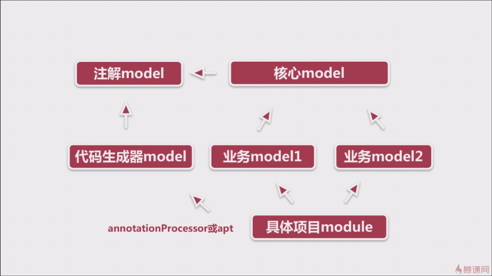
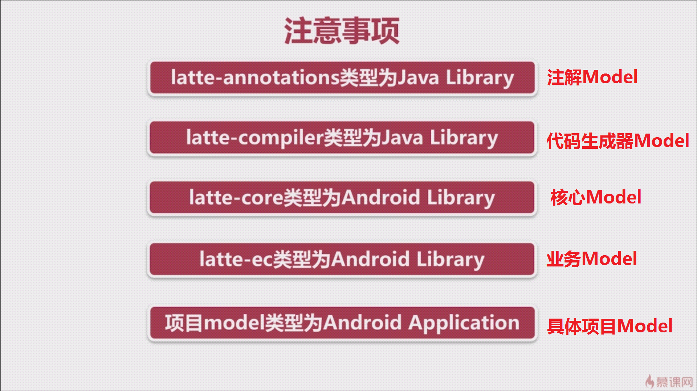
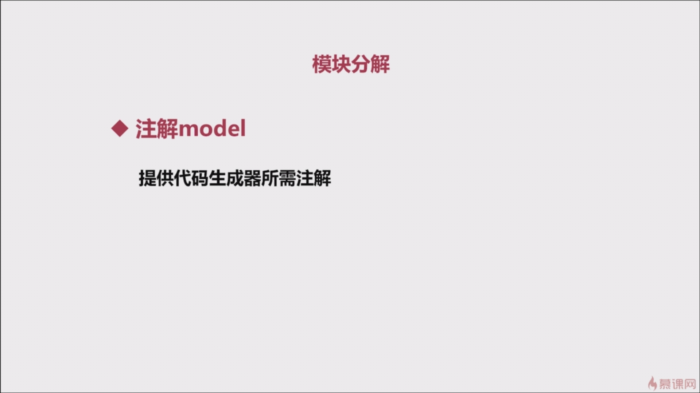
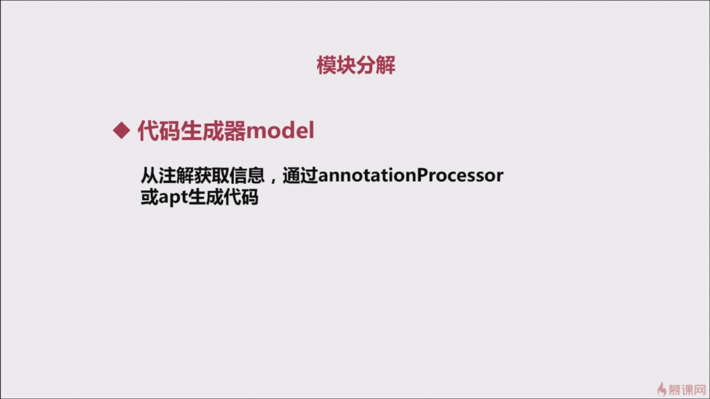
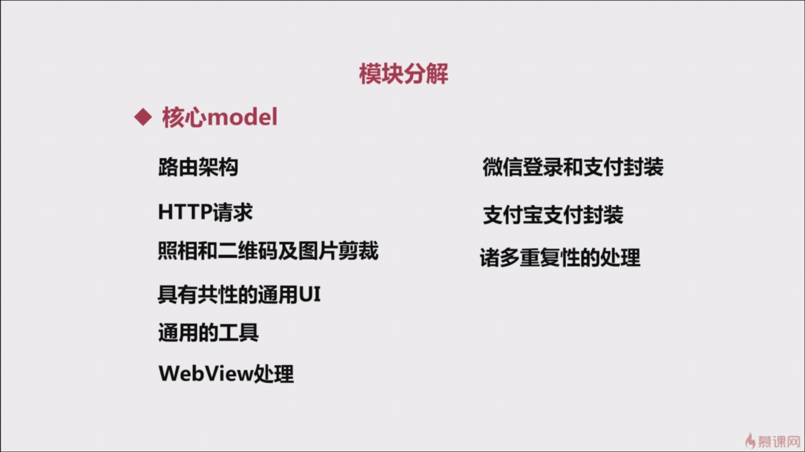
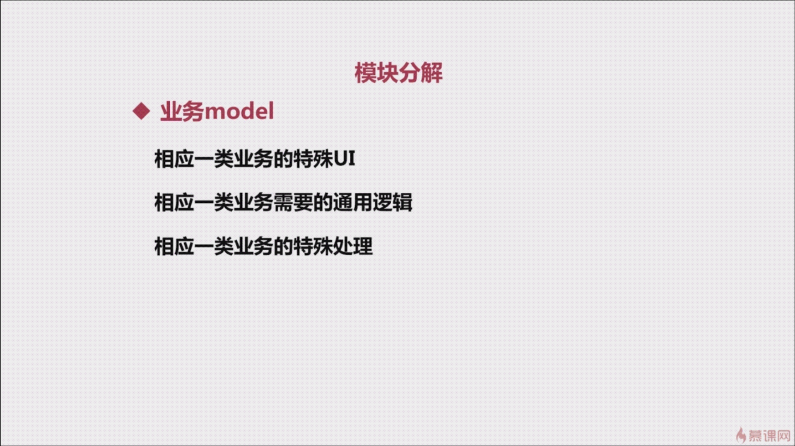
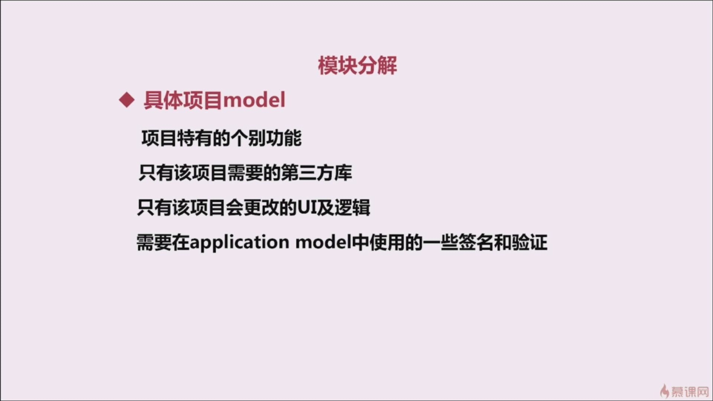

## 模块分解

## 使用一个Activity+多个Fragment的架构

**好处**：

* 切换顺滑
* 便于全局的统一处理

## 注意事项

* 有依赖关系的两个Android library的package name不能相同
* 根目录的ignore文件配置好后，各个library下的ignore文件可以删除。
见 [ignore文件.md](../版本控制/git/ignore文件.md)
* 将对代码生成器Model（latte-compiler）的依赖关系由compiler改为annotationProcessor
（“annotationProcessor”为AndroidStudio新版的注解解释器，旧版的为“apt”，建议使用新版的）
* 可将业务Model（latte-ec）和具体项目Model（app）中与核心Model（latte-core）重复的依赖删除。
包括androidTestCompile、compile、testCompile，不包括compile fileTree（这是对项目目录中的jar包的依赖）。